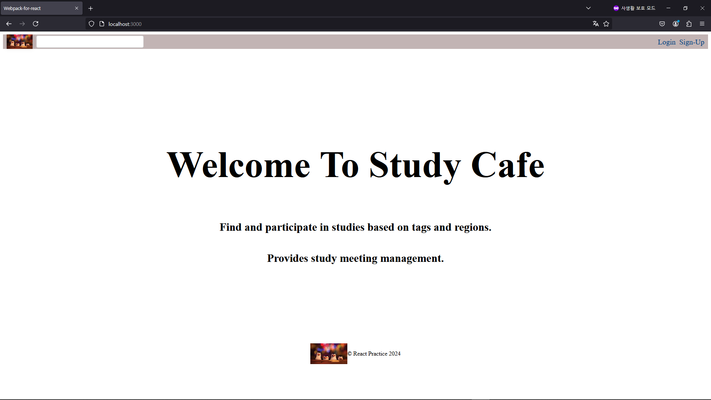
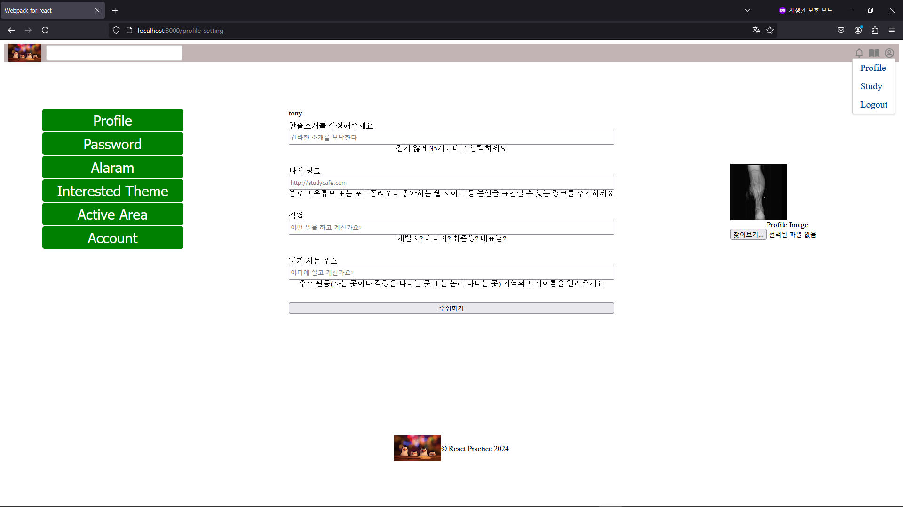
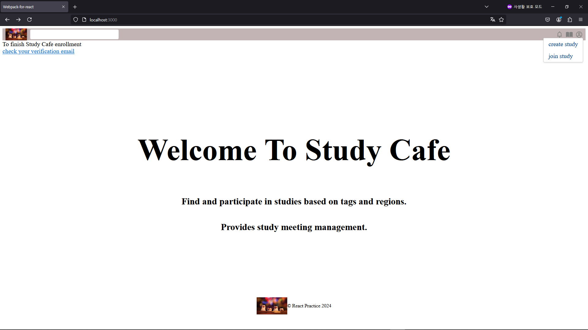
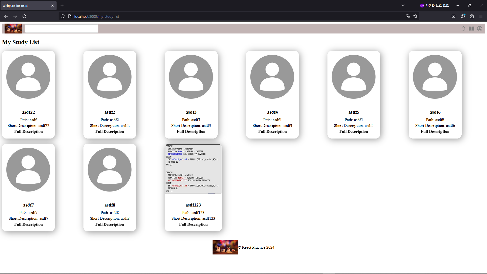
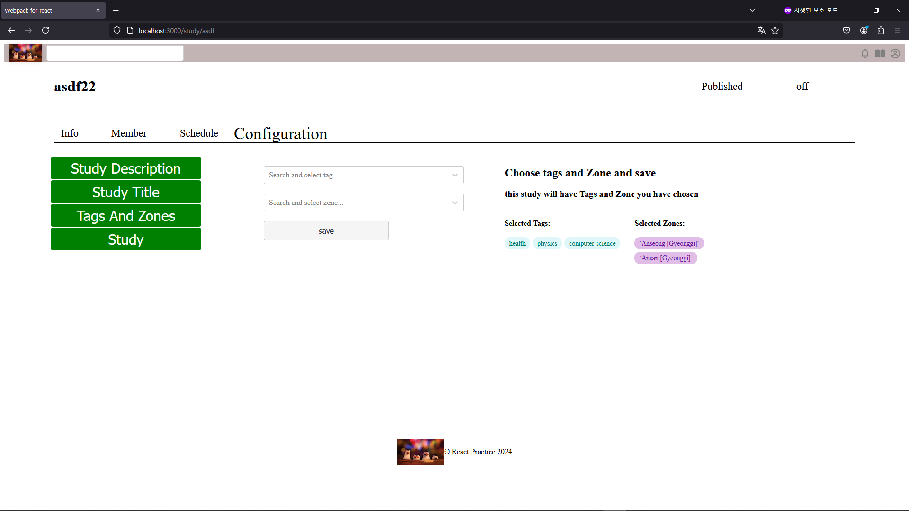
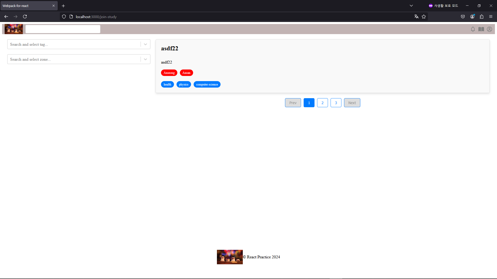

# StudyCafe_Server_For_React

it is a website that is used for creating study , and let other people join study that you created

## Features

- **Login and Logout with Email Verification**
    - Emails are sent asynchronously
    - once you verify email , then you can create your own study
- **Create Study**
    - you can own multiple study and join multiple study
    - once you create your study you will be a manager of study and have authority to publish one
    - schedule members and you for studying
    - study image, tag and zone can be configured

## Installation

currently no deployment pipe line
- deployed at [tonylimtest123.duckdns.org](http://tonylimtest123.duckdns.org/)

- **manual way**
    - docker need to be installed
    - deploy server with following commands
      ```bash
      git clone https://github.com/kuuku123/StudyCafe_Server_For_React.git
      cd StudyCafe_Server_For_React
      ./deploy.sh
      ```
    - and then deploy https://github.com/kuuku123/StudyCafe_React

## Usage


signup and login


check and edit your profile


create study


bunch of studies user(owner) created



1) choose tags and zones then publish your study
2) remove tags and zones by clicking


join study and filter studies by tags and zones

## Contributing

Guidelines on how others can contribute to your project.

## License

This project is licensed under the MIT License.
